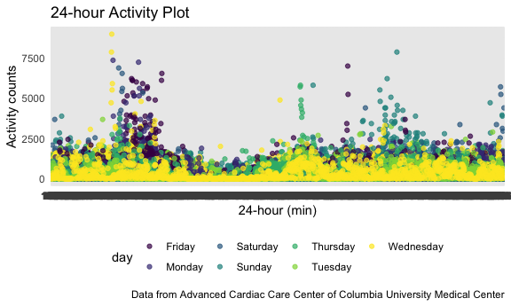

Homework 3
================
Jingyi Zhang

``` r
library(tidyverse)
```

    ## ── Attaching packages ────────────────────────────────────────────────────────────── tidyverse 1.3.0 ──

    ## ✓ ggplot2 3.3.2     ✓ purrr   0.3.4
    ## ✓ tibble  3.0.3     ✓ dplyr   1.0.2
    ## ✓ tidyr   1.1.2     ✓ stringr 1.4.0
    ## ✓ readr   1.3.1     ✓ forcats 0.5.0

    ## ── Conflicts ───────────────────────────────────────────────────────────────── tidyverse_conflicts() ──
    ## x dplyr::filter() masks stats::filter()
    ## x dplyr::lag()    masks stats::lag()

``` r
library(readxl)

knitr::opts_chunk$set(
  fig.width = 6,
  fig.asp = .6,
  out.width = "90%"
)

theme_set(theme_minimal() + theme(legend.position = "bottom"))
          
options(
  ggplot2.continuous.colour = "viridis",
  ggplot2.continuous.fill = "viridis"
)

scale_colour_discrete = scale_colour_viridis_d
scale_fill_discrete = scale_fill_viridis_d
```

## Problem 1

## Problem 2

##### Load and tidy the dataset.

``` r
accel_df = 
  read_csv("./data/accel_data.csv") %>%
  janitor::clean_names() %>%
  mutate(
    day = factor(day),
    weekday = case_when(
      day == "Monday" ~ "Monday",
      day == "Tuesday" ~ "Tuesday",
      day == "Wednesday" ~ "Wednesday",
      day == "Thursday" ~ "Thursday",
      day == "Friday" ~ "Friday"),
    weekend = case_when(
      day == "Saturday" ~ "Saturday",
      day == "Sunday" ~ "Sunday")
    ) %>%
  pivot_longer(
    activity_1:activity_1440,
    names_to = "minute",
    names_prefix = "activity_",
    values_to = "activity_counts"
  )
```

    ## Parsed with column specification:
    ## cols(
    ##   .default = col_double(),
    ##   day = col_character()
    ## )

    ## See spec(...) for full column specifications.

This dataset contains information on five weeks of accelerometer data
collected from a 63 year-old male with BMI 25 and diagnosed with
congestive heart failure. After cleaning and tidying, the final dataset
contains week, day id, day, weekday, weekend, minute, and activity
counts columns. It has a total of 50400 rows and 7 columns.

<br />

##### Create a total activity variable for each day, and create a table showing these totals.

``` r
accel_df %>%
  group_by(day_id) %>%
  summarize(total_activity = sum(activity_counts)) %>%
  ungroup()
```

    ## `summarise()` ungrouping output (override with `.groups` argument)

    ## # A tibble: 35 x 2
    ##    day_id total_activity
    ##     <dbl>          <dbl>
    ##  1      1        480543.
    ##  2      2         78828.
    ##  3      3        376254 
    ##  4      4        631105 
    ##  5      5        355924.
    ##  6      6        307094.
    ##  7      7        340115.
    ##  8      8        568839 
    ##  9      9        295431 
    ## 10     10        607175 
    ## # … with 25 more rows

Describe trends?

##### Make a single-panel plot

``` r
accel_df %>%
  ggplot(aes(x = minute, y = activity_counts, color = day)) +
  geom_point(alpha = .7) +
  labs(
    title = "24-hour Activity Plot",
    x = "24-hour (min)",
    y = "Activity counts",
    caption = "Data from Advanced Cardiac Care Center of Columbia University Medical Center"
  )
```



Describe patterns or conclusions based on this graph.
