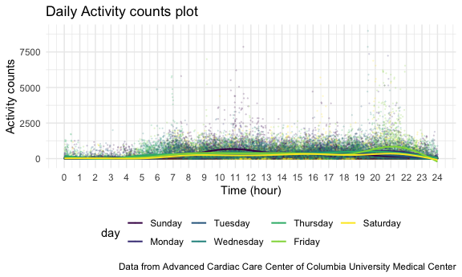

Homework 3
================
Jingyi Zhang

``` r
library(tidyverse)
```

    ## ── Attaching packages ────────────────────────────────────────────────────────────── tidyverse 1.3.0 ──

    ## ✓ ggplot2 3.3.2     ✓ purrr   0.3.4
    ## ✓ tibble  3.0.3     ✓ dplyr   1.0.2
    ## ✓ tidyr   1.1.2     ✓ stringr 1.4.0
    ## ✓ readr   1.3.1     ✓ forcats 0.5.0

    ## ── Conflicts ───────────────────────────────────────────────────────────────── tidyverse_conflicts() ──
    ## x dplyr::filter() masks stats::filter()
    ## x dplyr::lag()    masks stats::lag()

``` r
library(p8105.datasets)
library(readxl)
library(ggridges)
library(patchwork)

knitr::opts_chunk$set(
  fig.width = 6,
  fig.asp = .6,
  out.width = "90%"
)

theme_set(theme_minimal() + theme(legend.position = "bottom"))
          
options(
  ggplot2.continuous.colour = "viridis",
  ggplot2.continuous.fill = "viridis"
)

scale_colour_discrete = scale_colour_viridis_d
scale_fill_discrete = scale_fill_viridis_d
```

## Problem 1

``` r
data("instacart")
```

This dataset contains 1384617 rows and 15 columns.

Observations are the level of items in orders by user. There are user/
order variables – user ID, order ID, order day, and order hour. There
are also item variables – name, aisle, department, and some numeric
codes.

##### How many aisles, and which are most items from?

``` r
instacart %>%
  count(aisle) %>%
  arrange(desc(n))
```

    ## # A tibble: 134 x 2
    ##    aisle                              n
    ##    <chr>                          <int>
    ##  1 fresh vegetables              150609
    ##  2 fresh fruits                  150473
    ##  3 packaged vegetables fruits     78493
    ##  4 yogurt                         55240
    ##  5 packaged cheese                41699
    ##  6 water seltzer sparkling water  36617
    ##  7 milk                           32644
    ##  8 chips pretzels                 31269
    ##  9 soy lactosefree                26240
    ## 10 bread                          23635
    ## # … with 124 more rows

##### Make a plot

``` r
instacart %>%
  count(aisle) %>%
  filter(n > 10000) %>%
  mutate(
    aisle = factor(aisle),
    aisle = fct_reorder(aisle, n)
  ) %>%
  ggplot(aes(x = aisle, y = n)) +
  geom_point() +
  theme(axis.text.x = element_text(angle = 90, vjust = 0.5, hjust = 1))
```


##### Make a table showing the three most popular items in each of the aisles.

``` r
instacart %>%
  filter(aisle %in% c("baking ingredients", "dog food care", "packaged vegetables fruits")) %>%
  group_by(aisle) %>%
  count(product_name) %>%
  mutate(rank = min_rank(desc(n))) %>%
  filter(rank < 4) %>%
  arrange(aisle, rank) %>%
  knitr::kable()
```

| aisle                      | product\_name                                 |    n | rank |
| :------------------------- | :-------------------------------------------- | ---: | ---: |
| baking ingredients         | Light Brown Sugar                             |  499 |    1 |
| baking ingredients         | Pure Baking Soda                              |  387 |    2 |
| baking ingredients         | Cane Sugar                                    |  336 |    3 |
| dog food care              | Snack Sticks Chicken & Rice Recipe Dog Treats |   30 |    1 |
| dog food care              | Organix Chicken & Brown Rice Recipe           |   28 |    2 |
| dog food care              | Small Dog Biscuits                            |   26 |    3 |
| packaged vegetables fruits | Organic Baby Spinach                          | 9784 |    1 |
| packaged vegetables fruits | Organic Raspberries                           | 5546 |    2 |
| packaged vegetables fruits | Organic Blueberries                           | 4966 |    3 |

##### Make a table showing apples vs. ice cream

``` r
instacart %>%
  filter(product_name %in% c("Pink Lady Apples", "Coffee Ice Cream")) %>%
  group_by(product_name, order_dow) %>%
  summarize(mean_hour = mean(order_hour_of_day)) %>%
  pivot_wider(
    names_from = order_dow,
    values_from = mean_hour
  ) %>%
  knitr::kable()
```

    ## `summarise()` regrouping output by 'product_name' (override with `.groups` argument)

| product\_name    |        0 |        1 |        2 |        3 |        4 |        5 |        6 |
| :--------------- | -------: | -------: | -------: | -------: | -------: | -------: | -------: |
| Coffee Ice Cream | 13.77419 | 14.31579 | 15.38095 | 15.31818 | 15.21739 | 12.26316 | 13.83333 |
| Pink Lady Apples | 13.44118 | 11.36000 | 11.70213 | 14.25000 | 11.55172 | 12.78431 | 11.93750 |

<br />

## Problem 2

##### Load and tidy the dataset.

``` r
accel_df = 
  read_csv("./data/accel_data.csv") %>%
  janitor::clean_names() %>%
  mutate(
    day = factor(day),
    weekday = case_when(
      day == "Monday" ~ "Monday",
      day == "Tuesday" ~ "Tuesday",
      day == "Wednesday" ~ "Wednesday",
      day == "Thursday" ~ "Thursday",
      day == "Friday" ~ "Friday"),
    weekend = case_when(
      day == "Saturday" ~ "Saturday",
      day == "Sunday" ~ "Sunday")
    ) %>%
  pivot_longer(
    activity_1:activity_1440,
    names_to = "minute",
    names_prefix = "activity_",
    values_to = "activity_counts"
  )
```

    ## Parsed with column specification:
    ## cols(
    ##   .default = col_double(),
    ##   day = col_character()
    ## )

    ## See spec(...) for full column specifications.

``` r
accel_df = 
  mutate_at(accel_df, vars(minute), as.numeric)
```

This dataset contains information on five weeks of accelerometer data
collected from a 63 year-old male with BMI 25 and diagnosed with
congestive heart failure. After cleaning and tidying, the final dataset
contains week, day id, day, weekday, weekend, minute, and activity
counts columns. It has a total of 50400 rows and 7 columns.

<br />

##### Create a total activity variable for each day, and create a table showing these totals.

``` r
accel_df %>%
  group_by(day_id) %>%
  summarize(total_activity = sum(activity_counts)) %>%
  knitr::kable()
```

    ## `summarise()` ungrouping output (override with `.groups` argument)

| day\_id | total\_activity |
| ------: | --------------: |
|       1 |       480542.62 |
|       2 |        78828.07 |
|       3 |       376254.00 |
|       4 |       631105.00 |
|       5 |       355923.64 |
|       6 |       307094.24 |
|       7 |       340115.01 |
|       8 |       568839.00 |
|       9 |       295431.00 |
|      10 |       607175.00 |
|      11 |       422018.00 |
|      12 |       474048.00 |
|      13 |       423245.00 |
|      14 |       440962.00 |
|      15 |       467420.00 |
|      16 |       685910.00 |
|      17 |       382928.00 |
|      18 |       467052.00 |
|      19 |       371230.00 |
|      20 |       381507.00 |
|      21 |       468869.00 |
|      22 |       154049.00 |
|      23 |       409450.00 |
|      24 |         1440.00 |
|      25 |       260617.00 |
|      26 |       340291.00 |
|      27 |       319568.00 |
|      28 |       434460.00 |
|      29 |       620860.00 |
|      30 |       389080.00 |
|      31 |         1440.00 |
|      32 |       138421.00 |
|      33 |       549658.00 |
|      34 |       367824.00 |
|      35 |       445366.00 |

``` r
accel_df %>%
  group_by(day_id) %>%
  summarize(total_activity = sum(activity_counts)) %>%
  arrange(desc(total_activity))
```

    ## `summarise()` ungrouping output (override with `.groups` argument)

    ## # A tibble: 35 x 2
    ##    day_id total_activity
    ##     <dbl>          <dbl>
    ##  1     16        685910 
    ##  2      4        631105 
    ##  3     29        620860 
    ##  4     10        607175 
    ##  5      8        568839 
    ##  6     33        549658 
    ##  7      1        480543.
    ##  8     12        474048 
    ##  9     21        468869 
    ## 10     15        467420 
    ## # … with 25 more rows

The participant had the most activity counts on the 16th day and the
least activity counts on the 31st day.

<br />

##### Make a single-panel plot

``` r
accel_df %>%
  mutate(
    day = forcats::fct_relevel(day, c("Sunday", "Monday", "Tuesday", "Wednesday", "Thursday", "Friday", "Saturday"))
    ) %>%
  group_by(day, minute) %>%
  ggplot(aes(x = minute, y = activity_counts, color = day)) +
  geom_point(alpha = 0.15, size = 0.1) +
  geom_smooth(se = FALSE, size = 0.7) +
  labs(
    title = "Daily Activity counts plot",
    x = "Time (hour)",
    y = "Average activity counts",
    caption = "Data from Advanced Cardiac Care Center of Columbia University Medical Center"
  ) +
  scale_x_continuous(breaks = c(0, 60, 120, 180, 240, 300, 360, 420, 480, 540, 600, 660, 720, 780, 840, 900, 960, 1020, 1080, 1140, 1200, 1260, 1320, 1380, 1440), labels = c("0", "1", "2", "3", "4", "5", "6", "7", "8", "9", "10", "11", "12", "13", "14", "15", "16", "17", "18", "19", "20", "21", "22", "23", "24"))
```

    ## `geom_smooth()` using method = 'gam' and formula 'y ~ s(x, bs = "cs")'



This person was more active during 10am to 12pm on Sunday and 8pm to
10pm on Friday than other times during the week.

<br />

## Problem 3

##### Load and tidy the dataset

``` r
data("ny_noaa")

ny_noaa =
  mutate_at(ny_noaa, vars(date), as.factor) %>%
  separate(date, into = c("year", "month", "day"))

ny_noaa =
  mutate_at(ny_noaa, vars(tmax, tmin), as.numeric) %>%
  mutate(
    prcp = prcp / 10,
    tmax = tmax / 10,
    tmin = tmin / 10
  ) %>%
  mutate_at(vars(year, month, day), as.factor)
```

<br />

##### The most commonly observed values for snowfall.

``` r
ny_noaa %>%
  count(snow) %>%
  arrange(desc(n))
```

    ## # A tibble: 282 x 2
    ##     snow       n
    ##    <int>   <int>
    ##  1     0 2008508
    ##  2    NA  381221
    ##  3    25   31022
    ##  4    13   23095
    ##  5    51   18274
    ##  6    76   10173
    ##  7     8    9962
    ##  8     5    9748
    ##  9    38    9197
    ## 10     3    8790
    ## # … with 272 more rows

The most commonly observed values for snowfall is zero. This is because
New York state in general doesn’t get a lot of snow.

<br />

##### Make a two-panel plot showing the average max temperature in January and July in each station across years.

``` r
month.labs = c("January", "July")
names(month.labs) = c("01", "07")


ny_noaa %>%
  group_by(id, month, year) %>%
  summarize(mean_tmax = mean(tmax)) %>%
  filter(month %in% c("01", "07")) %>%
  ggplot(aes(x = year, y = mean_tmax, fill = year)) +
  geom_boxplot() +
  theme(axis.text.x = element_text(angle = -90, vjust = 0.5, hjust = 1)) +
    labs(
    title = "Average max temperature in New York, January vs. July",
    x = "Time (year)",
    y = "Average max temperature (C)",
    caption = "Data from NOAA National Climatic Data Center"
  ) +
  facet_grid(
    . ~ month,
    labeller = labeller(month = month.labs)
    )
```

    ## `summarise()` regrouping output by 'id', 'month' (override with `.groups` argument)

    ## Warning: Removed 7058 rows containing non-finite values (stat_boxplot).


Is there any observable/interpretable structure? outliers?

<br />

##### Make a two-panel plot showing tmax vs. tmin & make a plot showing the distribution of snowfall values 0\<X\<100 by year

``` r
tmax_tmin_p =
  ny_noaa %>%
  ggplot(aes(x = tmin, y = tmax)) +
  geom_hex() +
    labs(
    title = "Max vs. min temperature",
    x = "Max temperature (C)",
    y = "Min temperature (C)",
    caption = "Data from NOAA National Climatic Data Center"
  ) +
  theme(legend.position = "right")

snow_p =
  ny_noaa %>%
  filter(snow > 0 & snow < 100) %>%
  ggplot(aes(x = year, y = snow, color = year)) +
  geom_boxplot() +
  theme(axis.text.x = element_text(angle = -90, vjust = 0.5, hjust = 1)) +
      labs(
    title = "Snowfall between 0 to 100",
    x = "Time (year)",
    y = "Snowfall (mm)",
    caption = "Data from NOAA National Climatic Data Center"
  ) +
    theme(legend.position = "right")


tmax_tmin_p + snow_p
```

    ## Warning: Removed 1136276 rows containing non-finite values (stat_binhex).


