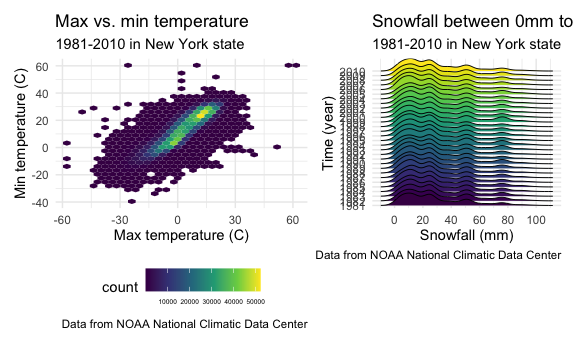

Homework 3
================
Jingyi Zhang

``` r
library(tidyverse)
```

    ## ── Attaching packages ────────────────────────────────────────────────────────────── tidyverse 1.3.0 ──

    ## ✓ ggplot2 3.3.2     ✓ purrr   0.3.4
    ## ✓ tibble  3.0.3     ✓ dplyr   1.0.2
    ## ✓ tidyr   1.1.2     ✓ stringr 1.4.0
    ## ✓ readr   1.3.1     ✓ forcats 0.5.0

    ## ── Conflicts ───────────────────────────────────────────────────────────────── tidyverse_conflicts() ──
    ## x dplyr::filter() masks stats::filter()
    ## x dplyr::lag()    masks stats::lag()

``` r
library(p8105.datasets)
library(readxl)
library(ggridges)
library(patchwork)

knitr::opts_chunk$set(
  fig.width = 6,
  fig.asp = .6,
  out.width = "90%"
)

theme_set(theme_minimal() + theme(legend.position = "bottom"))
          
options(
  ggplot2.continuous.colour = "viridis",
  ggplot2.continuous.fill = "viridis"
)

scale_colour_discrete = scale_colour_viridis_d
scale_fill_discrete = scale_fill_viridis_d
```

<br />

## Problem 1

``` r
data("instacart")
```

This dataset contains 1384617 rows and 15 columns.

Observations are the level of items in orders by user. There are user/
order variables – user ID, order ID, order day, and order hour. There
are also item variables – name, aisle, department, and some numeric
codes.

<br />

##### How many aisles, and which are most items from?

``` r
instacart %>%
  count(aisle) %>%
  arrange(desc(n))
```

    ## # A tibble: 134 x 2
    ##    aisle                              n
    ##    <chr>                          <int>
    ##  1 fresh vegetables              150609
    ##  2 fresh fruits                  150473
    ##  3 packaged vegetables fruits     78493
    ##  4 yogurt                         55240
    ##  5 packaged cheese                41699
    ##  6 water seltzer sparkling water  36617
    ##  7 milk                           32644
    ##  8 chips pretzels                 31269
    ##  9 soy lactosefree                26240
    ## 10 bread                          23635
    ## # … with 124 more rows

<br />

##### Make a plot that shows the number of items ordered in each aisle.

``` r
instacart %>%
  count(aisle) %>%
  filter(n > 10000) %>%
  mutate(
    aisle = factor(aisle),
    aisle = fct_reorder(aisle, n)
  ) %>%
  ggplot(aes(x = aisle, y = n)) +
  geom_point() +
  theme(axis.text.x = element_text(angle = 90, vjust = 0.5, hjust = 1))
```


<br />

##### Make a table showing the three most popular items in each of the aisles.

``` r
instacart %>%
  filter(aisle %in% c("baking ingredients", "dog food care", "packaged vegetables fruits")) %>%
  group_by(aisle) %>%
  count(product_name) %>%
  mutate(rank = min_rank(desc(n))) %>%
  filter(rank < 4) %>%
  arrange(aisle, rank) %>%
  knitr::kable()
```

| aisle                      | product\_name                                 |    n | rank |
| :------------------------- | :-------------------------------------------- | ---: | ---: |
| baking ingredients         | Light Brown Sugar                             |  499 |    1 |
| baking ingredients         | Pure Baking Soda                              |  387 |    2 |
| baking ingredients         | Cane Sugar                                    |  336 |    3 |
| dog food care              | Snack Sticks Chicken & Rice Recipe Dog Treats |   30 |    1 |
| dog food care              | Organix Chicken & Brown Rice Recipe           |   28 |    2 |
| dog food care              | Small Dog Biscuits                            |   26 |    3 |
| packaged vegetables fruits | Organic Baby Spinach                          | 9784 |    1 |
| packaged vegetables fruits | Organic Raspberries                           | 5546 |    2 |
| packaged vegetables fruits | Organic Blueberries                           | 4966 |    3 |

<br />

##### Make a table showing apples vs. ice cream

``` r
instacart %>%
  filter(product_name %in% c("Pink Lady Apples", "Coffee Ice Cream")) %>%
  group_by(product_name, order_dow) %>%
  summarize(mean_hour = mean(order_hour_of_day)) %>%
  pivot_wider(
    names_from = order_dow,
    values_from = mean_hour
  ) %>%
  knitr::kable()
```

    ## `summarise()` regrouping output by 'product_name' (override with `.groups` argument)

| product\_name    |        0 |        1 |        2 |        3 |        4 |        5 |        6 |
| :--------------- | -------: | -------: | -------: | -------: | -------: | -------: | -------: |
| Coffee Ice Cream | 13.77419 | 14.31579 | 15.38095 | 15.31818 | 15.21739 | 12.26316 | 13.83333 |
| Pink Lady Apples | 13.44118 | 11.36000 | 11.70213 | 14.25000 | 11.55172 | 12.78431 | 11.93750 |

<br />

## Problem 2

##### Load and tidy the dataset.

``` r
accel_df = 
  read_csv("./data/accel_data.csv") %>%
  janitor::clean_names() %>%
  pivot_longer(
    activity_1:activity_1440,
    names_to = "minute",
    names_prefix = "activity_",
    values_to = "activity_counts"
  ) %>%
  mutate(
    day = factor(day),
    weekday_weekend = case_when(
     day == "Monday" ~ "weekday",
     day == "Tuesday" ~ "weekday",
     day == "Wednesday" ~ "weekday",
     day == "Thursday" ~ "weekday",
     day == "Friday" ~ "weekday",
     day == "Saturday" ~ "weekend",
     day == "Sunday" ~ "weekend"))
```

    ## Parsed with column specification:
    ## cols(
    ##   .default = col_double(),
    ##   day = col_character()
    ## )

    ## See spec(...) for full column specifications.

``` r
accel_df = 
  mutate_at(accel_df, vars(week), as.character) %>%
  mutate_at(vars(minute), as.numeric) %>%
  mutate(
    week = forcats::fct_relevel(week, 
      c("1", "2", "3", "4", "5")),
    day = forcats::fct_relevel(day, 
      c("Sunday", "Monday", "Tuesday", "Wednesday", "Thursday", "Friday", "Saturday")
  ))
```

``` r
accel_df = 
  accel_df %>%
  group_by(week) %>%
  arrange(day, .by_group = TRUE) %>%
  group_by(day_id) %>%
  mutate(min_week = 1,
         hour = cumsum(min_week) %/% 60) %>%
  ungroup(day_id) %>%
  select(-min_week)
```

This dataset contains information on five weeks of accelerometer data
collected from a 63 year-old male with BMI 25 and diagnosed with
congestive heart failure. During the cleaning and tidying process,
columns activity\_1 - activity\_1440 are put into a tidier form with a
minute column and a activity\_counts column. A new variable weekday
vs. weekend is created with Monday to Friday coded as “weekday” and
Saturday, Sunday as “weekend”. Week and day are reordered into correct
order. Lastly, a new variable hour is created for plotting. The final
dataset contains week, day id, day, minute, activity counts, weekday
vs. weekend, and hour variables. It has a total of 50400 rows and 7
columns.

<br />

##### Create a total activity variable for each day, and create a table showing these totals.

``` r
accel_df %>%
  group_by(week, day) %>%
  summarize(total_activity = sum(activity_counts, na.rm = TRUE)) %>%
  pivot_wider(
    names_from = week,
    names_prefix = "week",
    values_from = total_activity
  ) %>%
  knitr::kable()
```

    ## `summarise()` regrouping output by 'week' (override with `.groups` argument)

| day       |     week1 |  week2 |  week3 |  week4 |  week5 |
| :-------- | --------: | -----: | -----: | -----: | -----: |
| Sunday    | 631105.00 | 422018 | 467052 | 260617 | 138421 |
| Monday    |  78828.07 | 295431 | 685910 | 409450 | 389080 |
| Tuesday   | 307094.24 | 423245 | 381507 | 319568 | 367824 |
| Wednesday | 340115.01 | 440962 | 468869 | 434460 | 445366 |
| Thursday  | 355923.64 | 474048 | 371230 | 340291 | 549658 |
| Friday    | 480542.62 | 568839 | 467420 | 154049 | 620860 |
| Saturday  | 376254.00 | 607175 | 382928 |   1440 |   1440 |

This participant had the most activity counts on Sunday for week 1 and
the least activity counts on Saturday for week 4 and 5.

<br />

##### Make a single-panel plot that shows the 24-hour activity for each day.

``` r
accel_df %>%
  group_by(day_id, day, hour) %>%
  summarize(activity_counts_hr = sum(activity_counts, na.rm = TRUE)) %>%
  ggplot(aes(x = hour, y = activity_counts_hr, color = day, group = day_id)) +
  geom_line(alpha = 0.2, size = 0.4) +
  stat_smooth(se = FALSE, geom = "line") +
  scale_x_continuous(limits = c(0,24), breaks = seq(0,24,1)) +
  scale_y_continuous(limits = c(-10000, 60000), breaks = seq(-10000, 60000, 20000)) +
  labs(
    title = "Hourly activity counts in 35 days",
    x = "Time (hour)",
    y = "Hourly activity counts",
    caption = "Data from Advanced Cardiac Care Center of Columbia University Medical Center"
  )
```

    ## `summarise()` regrouping output by 'day_id', 'day' (override with `.groups` argument)

    ## `geom_smooth()` using method = 'loess' and formula 'y ~ x'

    ## Warning: Removed 19 rows containing non-finite values (stat_smooth).


The hourly activity counts in 35 days with smooth line plot shows that
the participant normally becomes active around 7am to 8am and inactive
after 5pm to 6pm. Most of days that participant is most active during
3pm-6pm. However, on Sundays and Mondays, the participant is most active
during 9am to 11am. There is one particular Saturday which the
participant’s activity counts are is throughout 24 hours.

<br />

## Problem 3

##### Load and tidy the dataset

``` r
data("ny_noaa")

ny_noaa =
  mutate_at(ny_noaa, vars(date), as.factor) %>%
  separate(date, into = c("year", "month", "day"))

ny_noaa =
  mutate_at(ny_noaa, vars(tmax, tmin), as.numeric) %>%
  mutate(
    prcp = prcp / 10,
    tmax = tmax / 10,
    tmin = tmin / 10
  ) %>%
  mutate_at(vars(year, month, day), as.factor)
```

``` r
summary(ny_noaa)
```

    ##       id                 year             month              day         
    ##  Length:2595176     2010   : 159671   10     : 224471   01     :  85258  
    ##  Class :character   2009   : 148721   12     : 223603   02     :  85258  
    ##  Mode  :character   2008   : 122665   07     : 220348   03     :  85258  
    ##                     2006   :  93249   08     : 220100   04     :  85258  
    ##                     2007   :  93176   05     : 220038   05     :  85258  
    ##                     2005   :  92177   01     : 217093   06     :  85258  
    ##                     (Other):1885517   (Other):1269523   (Other):2083628  
    ##       prcp              snow             snwd             tmax        
    ##  Min.   :   0.00   Min.   :  -13    Min.   :   0.0   Min.   :-38.9    
    ##  1st Qu.:   0.00   1st Qu.:    0    1st Qu.:   0.0   1st Qu.:  5.0    
    ##  Median :   0.00   Median :    0    Median :   0.0   Median : 15.0    
    ##  Mean   :   2.98   Mean   :    5    Mean   :  37.3   Mean   : 14.0    
    ##  3rd Qu.:   2.30   3rd Qu.:    0    3rd Qu.:   0.0   3rd Qu.: 23.3    
    ##  Max.   :2286.00   Max.   :10160    Max.   :9195.0   Max.   : 60.0    
    ##  NA's   :145838    NA's   :381221   NA's   :591786   NA's   :1134358  
    ##       tmin        
    ##  Min.   :-59.4    
    ##  1st Qu.: -3.9    
    ##  Median :  3.3    
    ##  Mean   :  3.0    
    ##  3rd Qu.: 11.1    
    ##  Max.   : 60.0    
    ##  NA's   :1134420

This dataset contains information collected from 747 New York state
weather stations from January 1, 1981 through December 31, 2010. It
contains id (weather station id), date, prcp (precipitation), snow
(snowfall), snwd (snow depth), tmax, and tmin variables. During the
cleaning and tidying process, date is separated into year, month, and
day. Prcp, tmax, and tmin’s units are converted from tenths of degree C
to degree C. One big issue for this dataset is the enormous amount of
missing values in prcp, snow, snwd, tmax, and tmin. The traditional
method of simply omitting missing values is not applicable in this
dataset. The final dataset contains id, year, month, day, prcp, snow,
snwd, tmax, and tmin. It has a total of 2595176 rows and 9 columns.

<br />

##### The most commonly observed values for snowfall

``` r
ny_noaa %>%
  count(snow) %>%
  arrange(desc(n))
```

    ## # A tibble: 282 x 2
    ##     snow       n
    ##    <int>   <int>
    ##  1     0 2008508
    ##  2    NA  381221
    ##  3    25   31022
    ##  4    13   23095
    ##  5    51   18274
    ##  6    76   10173
    ##  7     8    9962
    ##  8     5    9748
    ##  9    38    9197
    ## 10     3    8790
    ## # … with 272 more rows

The most commonly observed values for snowfall is zero. It can
interpreted as most days from 1981 to 2010 did not snow in New York
state. An outlier observed in snow is -13 which is an impossible number
to obtain for snowfall.

<br />

##### Make a two-panel plot showing the average max temperature in January and July in each station across years.

``` r
month.labs = c("January", "July")
names(month.labs) = c("01", "07")

average_max_temp_p =
  ny_noaa %>%
  group_by(id, month, year) %>%
  summarize(mean_tmax = mean(tmax, na.rm = TRUE)) %>%
  filter(month %in% c("01", "07")) %>%
  drop_na() %>%
  ggplot(aes(x = year, y = mean_tmax, color = id, group = id)) +
  geom_point(alpha = 0.35) +
  geom_path(alpha = 0.2) +
  theme(axis.text.x = element_text(angle = -60, vjust = 0.5, hjust = 1), legend.position = "none") +
    labs(
    title = "Average max temperature January vs. July",
    subtitle = "1981-2010 in New York state",
    x = "Time (year)",
    y = "Average max temperature (C)",
    caption = "Data from NOAA National Climatic Data Center"
  ) +
  facet_grid(
    . ~ month,
    labeller = labeller(month = month.labs)
    )
```

    ## `summarise()` regrouping output by 'id', 'month' (override with `.groups` argument)

The average max temperature in January across all stations ranges from
-10 C to 10 C. Three outliers observed below -10 C are in 1982, 1994,
and 2005. The average max temperature in July across all stations ranges
from 20 C to 35 C. Four outliers observed below 20 C are in 1984, 1988,
2004, and 2007. One outlier observed above 35 C is in 2010.

<br />

##### Make a two-panel plot showing tmax vs. tmin & make a plot showing the distribution of snowfall values 0\<X\<100 by year

``` r
tmax_tmin_p =
  ny_noaa %>%
  ggplot(aes(x = tmin, y = tmax)) +
  geom_hex() +
    labs(
    title = "Max vs. min temperature",
    subtitle = "1981-2010 in New York state",
    x = "Max temperature (C)",
    y = "Min temperature (C)",
    caption = "Data from NOAA National Climatic Data Center"
  ) +
  theme(legend.text = element_text(size = 5))


snow_p =
  ny_noaa %>%
  filter(snow > 0 & snow < 100) %>%
  drop_na() %>%
  ggplot(aes(x = snow, y = year)) +
  geom_density_ridges(aes(fill = year), scale = 3, size = 0.3) +
  scale_x_continuous(breaks = seq(0,100,20)) +
  theme(legend.position = "none") +
  labs(
    title = "Snowfall between 0mm to 100mm",
    subtitle = "1981-2010 in New York state",
    x = "Snowfall (mm)",
    y = "Time (year)",
    caption = "Data from NOAA National Climatic Data Center"
  )

tmax_tmin_p + snow_p + plot_layout(ncol = 2, width = c(2, 1.5))
```

    ## Warning: Removed 1136276 rows containing non-finite values (stat_binhex).

    ## Picking joint bandwidth of 4.24



For the max vs. min temperature plot, the most counts for max
temperature ranges from -10 C to 15 C, the most counts for min
temperature ranges from 0 C to 30 C. It is hard to conclude from the max
temperature that there is in fact global warming happening, however, the
min temperature may show some evidence for global warming.

For the snowfall plot, snowfall distributions across 1981 to 2010 are
very similar. The density graph shows three major peaks at 10mm-25mm,
50mm, and 75mm. It can be interpreted as the amount of snowfall from
1981 to 2010 did not change much. It did not show a clear evidence for
global warming since it is assumed that the amount of snowfall would
decrease.
